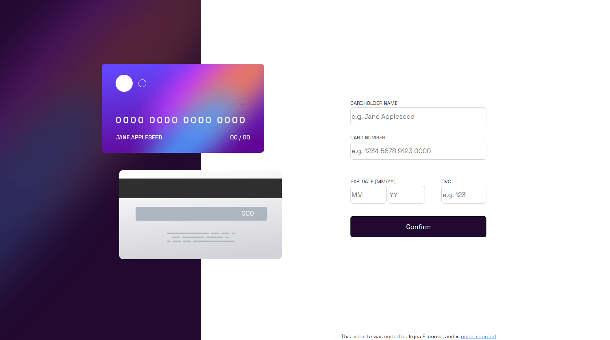

# Frontend Mentor - Interactive card details form solution

This is a solution to the [Interactive card details form challenge on Frontend Mentor](https://www.frontendmentor.io/challenges/interactive-card-details-form-XpS8cKZDWw).

## Table of contents

- [Overview](#overview)
  - [The challenge](#the-challenge)
  - [Screenshot](#screenshot)
  - [Links](#links)
- [My process](#my-process)
  - [Built with](#built-with)
  - [What I learned](#what-i-learned)
  - [Continued development](#continued-development)
- [Author](#author)

## Overview

### The challenge

Users should be able to:

- Fill in the form and see the card details update in real-time
- Receive error messages when the form is submitted if:
  - Any input field is empty
  - The card number, expiry date, or CVC fields are in the wrong format
- View the optimal layout depending on their device's screen size
- See hover, active, and focus states for interactive elements on the page

### Screenshot



### Links

- Solution URL: [Add solution URL here](https://your-solution-url.com)
- Live Site URL: [Add live site URL here](https://your-live-site-url.com)

## My process

### Built with

- CSS custom properties
- Flexbox
- Bootstrap
- JS

### What I learned

```html
required pattern="\d*"
```

```css
background-image: linear-gradient(white, white), radial-gradient(circle at top
      left, #6448fe, #600594);
background-origin: border-box;
background-clip: padding-box, border-box;
```

### Continued development

I want create this app with React JS.

## Author

- Website - [Interactive-card-details-form](https://harmonious-quokka-7a0fa0.netlify.app/)
- Frontend Mentor - [@ywonder-filka](https://www.frontendmentor.io/profile/wonder-filka)
- GitHub - [@wonder-filka](https://github.com/wonder-filka/Interactive-card-details-form)
